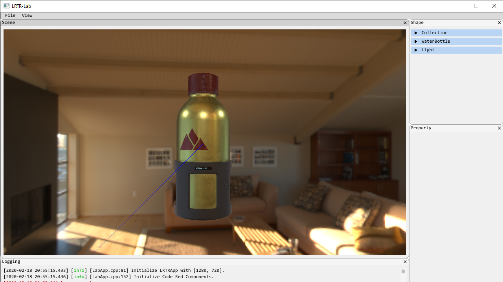

# LRTR-Lab

Link's Real-time Lab. This lab is used to implement and test some real-time rendering technology. It is based my project [Code-Red]() (In fact, I use Code-Red to handle the graphics api).

The most implementation of rendering technology are learned from some articles, blogs and books. 

## Rendering Effect

- PBR and IBL, Physically based rendering and image based lighting.
- SkyBox.
- Shadow Mapping.

## Scene Loader

- GLTF using TinyGLTF.

## Screenshots

